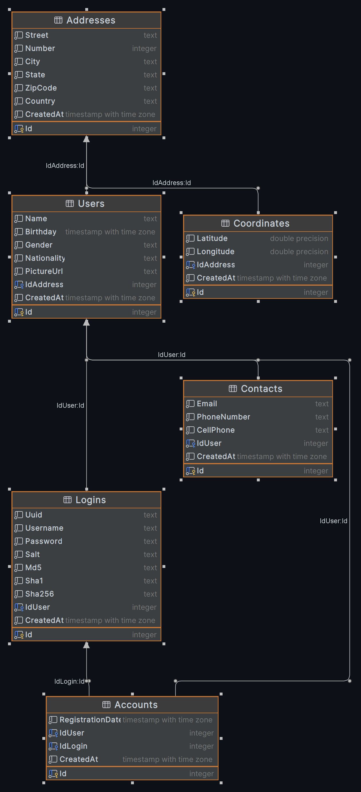
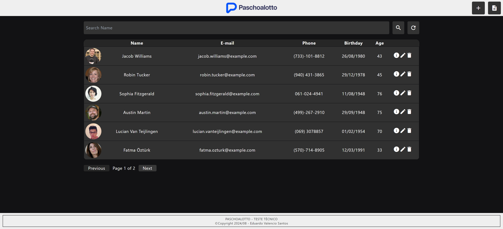
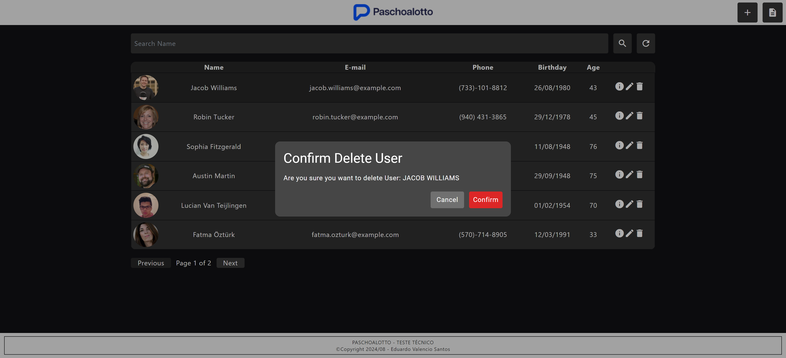
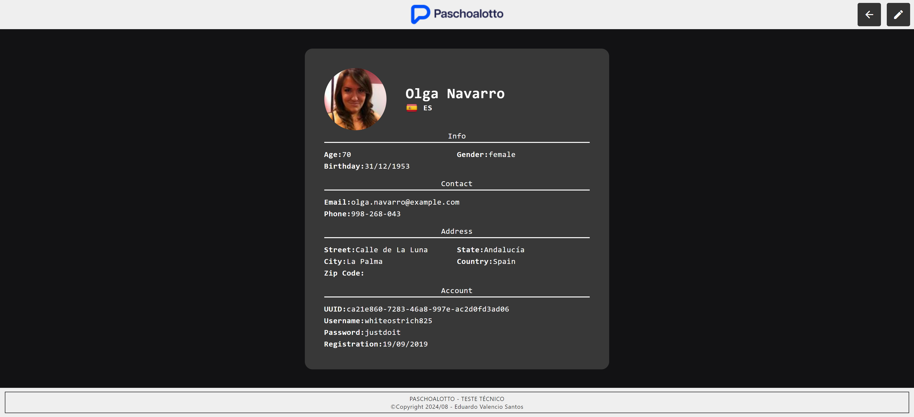
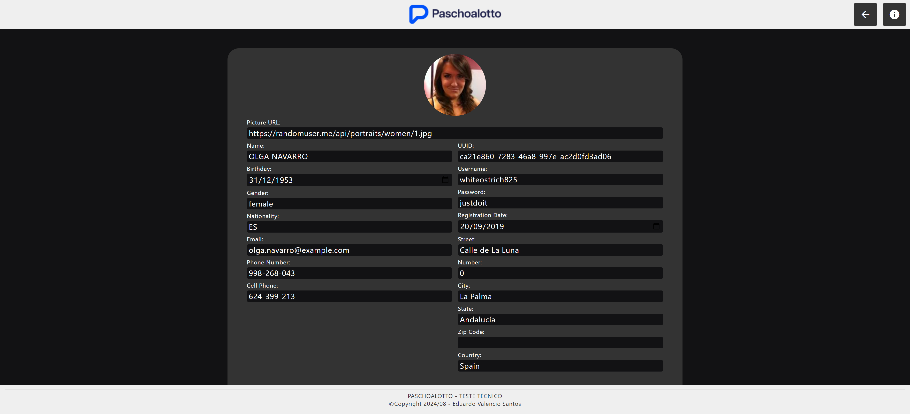
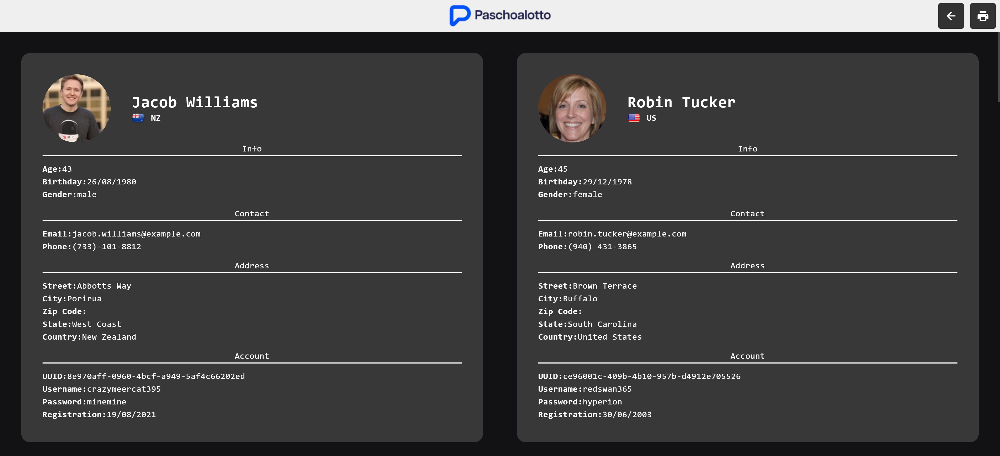
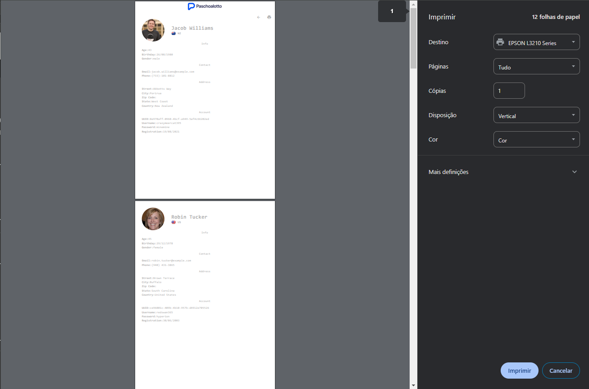

  

Random User API Consumer   Teste Técnico

  
  
  
  
  
  
  
  

Eduardo Valencio Santos

---

[Applicação](http://paschoalotto.eduardovalencio.site:4200) foi hospeada na AWS e esta a disposição para testes.
[http://paschoalotto.eduardovalencio.site:4200](http://paschoalotto.eduardovalencio.site:4200)

---

* [Versões e Apontamentos](#versões-e-apontamentos)
* [Arquiteture](#arquitetura)
    * [DataAnnotation e Templete](#data-anotation-template)
    * [Modelo Frontend](#modelo-frontend)
    * [Entidades no Banco de Dados](#entidades-no-banco-de-dados)
* [FrontEnd Preview](#preview-e-navegação-pelo-front-end)
* [Observações](#observações)

---

## Versões e Apontamentos
Para o desenvolvimento do Backend seguindo o case foi selecionado o `.NET 6` por ser uma versão LTS sendo utilizada em projetos mais recentes. No FrontEnd foi selecionado o `Angular 18` seguindo a descrição da vaga de `Desenvolvedor Full-Stack C# .NET Angular` 

Seguindo o case encaminhado a aplicação tem as seguintes funções:
- Utilizar Banco de Dados PostgreSQL (REQUESITO)
- Mapear Tabela Usuario
- Consumir API Random User (https://randomuser.me/api/)
- Gerar novos usuários
- Armazenar usuário na base
- Relatório de Usuário
- Listar todos os usuários no Banco
- Front-End 
- Exibir dados da tabela
- Editar dados

---

## Arquitetura
A arquitetura do projeto segue o modelo de CLEAN ARCHITECTURE separando a aplicação em projetos relevantes por responsabilidade, Domain, Application, Infrastructure, API, Communication etc...

### Data Anotation, Template
Para o projeto Backend não foi utilizado o minimal API para demonstrar de forma verbosa o dominio do framework com Dependency Injection sem utilizando de Data Annotation somente com configuração por Fluent API para o ORM.
Os dois templates utilizados para Aplicação foram WEB API MVC e CLASSLIB.

### Modelo Frontend
Para o Frontend foi utilizado a arquitetura padrão seguindo modules mesmo que para a versão 18 do Angular tenha a implementação de standalones, a arquitetura geral do projeto foi mantida, core para bibliotecas essenciais, shared para bibliotecas compartilhadas e feature para armazenar as paginas e componentes de cada module.
Durante o desenvolvimento do Front-End foi cogitado utilizar variáveis globais de contexto porém para os requisitos da aplicação não foi necessário a implementação.

### Entidades no banco de dados
As entidades foram criadas por meio migrations com EF

---

## Preview e Navegação pelo Front End

    
    
    
    
    
    

---

## Observações
Apesar de tentar se aproximar de um projeto real seguindo boas práticas quanto a arquitetura e fluxo de desenvolvimento os projetos não foram configurados para tal; contendo commits com arquivos de acesso como .env e outras configurações de CORS e segurança que em produção não deviam ser expostos.

